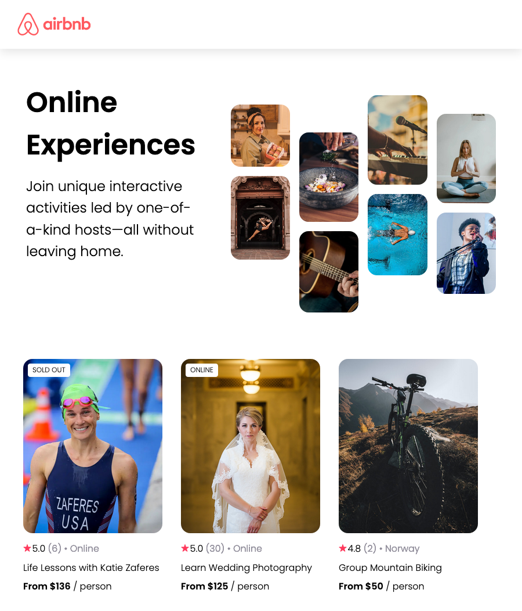

# Airbnb Experiences




This is the second module's project of Scrimba's [Learn React for free](https://scrimba.com/learn/learnreact) course.

[Figma design reference](https://www.figma.com/file/4YjrygFEXOcDp9AAnVFv7o/Airbnb-Experiences)

## Features
- Card components
- Responsive hero banner

---


## Run in development mode
```
npm start
```

## Build for production
```
npm run build
```

This project was bootstrapped with [Create React App](https://github.com/facebook/create-react-app)